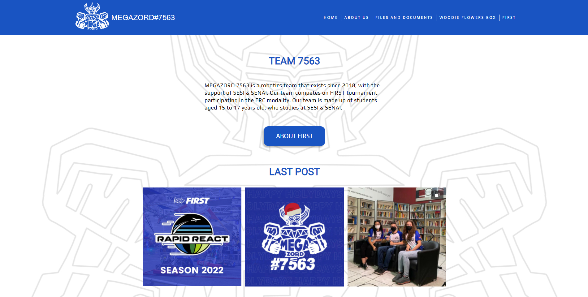

<h1 align="center"> Megazord 7563 </h1>

Site of Robotics Brazilian Team Megazord 7563

  <a href="#-tecnologias">Tecnologias</a>&nbsp;&nbsp;&nbsp;|&nbsp;&nbsp;&nbsp;
  <a href="#-projeto">Projeto</a>&nbsp;&nbsp;&nbsp;|&nbsp;&nbsp;&nbsp;
  <a href="#-layout">Layout</a>&nbsp;&nbsp;&nbsp;|&nbsp;&nbsp;&nbsp;
  <a href="#memo-licença">Licença</a>

  

 

  

## 🚀 Tecnologias

Esse projeto foi desenvolvido com as seguintes tecnologias:

- HTML e CSS
- JavaScript e JSON
- [Node e NPM](https://nodejs.org/)

## 💻 Projeto

A Megazord é um website criado única e especificamente para o time de robótica FRC Megazord#7563, com o objetivo de propagar a ciência e tecnologia além de instruções sobre o mundo da FIRST e do time.

## 🔖 Layout

Você pode visualizar o layout do projeto através [DESSE LINK](<https://www.figma.com/file/WmL8bOvd1NUebeAiqbYKuY/Megazord-(Copy)>). É necessário ter conta no [Figma](https://figma.com) para acessá-lo.

## :memo: Licença

Esse projeto está sob a licença MIT.

---

Feito com ♥ by Gabriel Cara.
